# Roteiro do vídeo — Construindo um Transformer (LLM) do zero

**Notebook:** `Transformer.ipynb` · **Cenas:** 33 · **Duração estimada:** 10:00 (narração a ~150 palavras por minuto)

Cada cena traz a captura de tela do notebook (texto explicativo, nota em português, código e saída) e o texto que o narrador deve ler. O tempo de cada cena é uma estimativa a partir do tamanho da narração.

## Sumário

| # | Início | Capítulo | Cena | Duração |
|---|---|---|---|---|
| 1 | 00:00 | — | Abertura | 18s |
| 2 | 00:18 | Trabalhando com dados de texto | As etapas da construção | 26s |
| 3 | 00:44 | Trabalhando com dados de texto | Quebrando o texto em tokens | 16s |
| 4 | 01:00 | Trabalhando com dados de texto | O tokenizador do GPT-2 | 18s |
| 5 | 01:18 | Trabalhando com dados de texto | Prevendo a próxima palavra | 18s |
| 6 | 01:36 | Trabalhando com dados de texto | De texto a vetores | 23s |
| 7 | 01:59 | Mecanismos de atenção | Capítulo 3: atenção | 15s |
| 8 | 02:14 | Mecanismos de atenção | Pontuações de atenção | 20s |
| 9 | 02:34 | Mecanismos de atenção | Pesos e vetor de contexto | 18s |
| 10 | 02:52 | Mecanismos de atenção | Query, key e value | 20s |
| 11 | 03:12 | Mecanismos de atenção | Máscara causal | 19s |
| 12 | 03:31 | Mecanismos de atenção | Várias cabeças de atenção | 19s |
| 13 | 03:50 | Montando o modelo GPT | Capítulo 4: a arquitetura | 14s |
| 14 | 04:04 | Montando o modelo GPT | Normalização de camada | 18s |
| 15 | 04:22 | Montando o modelo GPT | GELU e feed forward | 20s |
| 16 | 04:42 | Montando o modelo GPT | Conexões de atalho | 17s |
| 17 | 04:59 | Montando o modelo GPT | O bloco transformer | 20s |
| 18 | 05:19 | Montando o modelo GPT | O modelo GPT completo | 18s |
| 19 | 05:37 | Montando o modelo GPT | Gerando texto | 20s |
| 20 | 05:57 | Pré-treinamento | Capítulo 5: o ciclo de geração | 19s |
| 21 | 06:16 | Pré-treinamento | Medindo o erro | 17s |
| 22 | 06:33 | Pré-treinamento | Treino e overfitting | 19s |
| 23 | 06:52 | Pré-treinamento | Pesos oficiais do GPT-2 | 18s |
| 24 | 07:10 | Fine-tuning para classificação | Capítulo 6: classificação | 13s |
| 25 | 07:23 | Fine-tuning para classificação | Nova camada de saída | 18s |
| 26 | 07:41 | Fine-tuning para classificação | Treino e acurácia | 19s |
| 27 | 08:00 | Fine-tuning para classificação | Classificando mensagens | 14s |
| 28 | 08:14 | Fine-tuning com instruções | Capítulo 7: instruções | 18s |
| 29 | 08:32 | Fine-tuning com instruções | Montando os lotes | 19s |
| 30 | 08:51 | Fine-tuning com instruções | O modelo antes do ajuste | 16s |
| 31 | 09:07 | Fine-tuning com instruções | Treino e respostas | 18s |
| 32 | 09:25 | Fine-tuning com instruções | O Llama 3 como avaliador | 19s |
| 33 | 09:44 | — | Encerramento | 16s |

## Abertura

### Cena 1 — Abertura

*00:00 → 00:18 · 18 segundos*

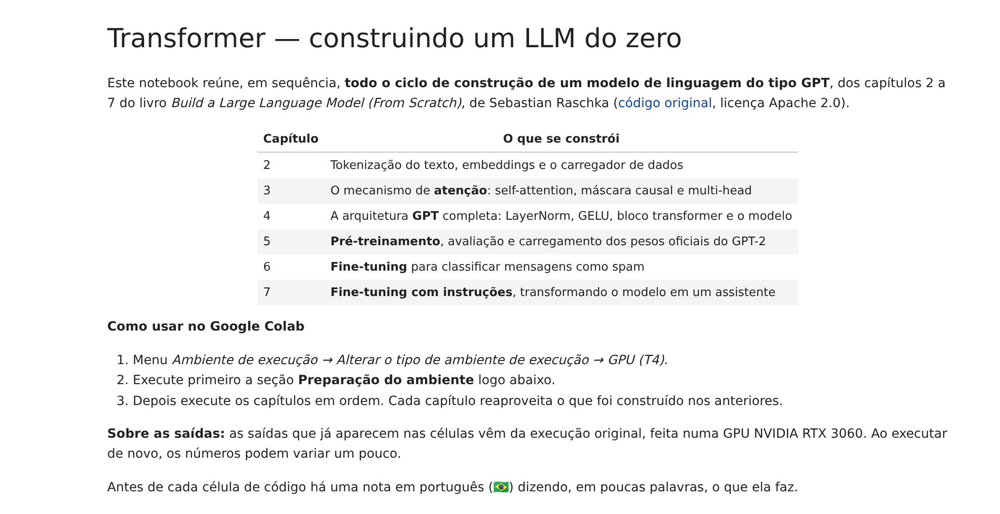

**📺 Na tela:** Título do notebook e a tabela com o que cada capítulo constrói.

**🎙️ Narração:** Nesta demonstração, vamos construir do zero um transformer, a arquitetura dos modelos de linguagem do tipo GPT, como o ChatGPT. A tabela mostra as etapas da construção: preparar o texto, programar a atenção, montar a arquitetura, pré-treinar e fazer dois tipos de ajuste fino.

## Capítulo 2 — Trabalhando com dados de texto

### Cena 2 — As etapas da construção

*00:18 → 00:44 · 26 segundos · 2 telas em sequência, dividindo o tempo entre elas*

**Tela A**

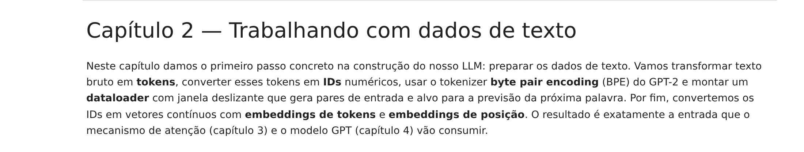

**Tela B**

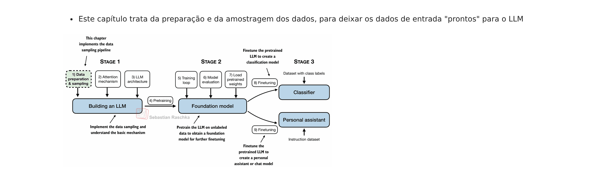

**📺 Na tela:** Tela A: título do capítulo 2. Tela B: o diagrama das três etapas (Stage 1, 2 e 3), com o passo 1 destacado em verde.

**🎙️ Narração:** Este diagrama mostra todas as etapas da construção de um LLM. Na etapa 1, construímos o modelo: preparamos os dados, programamos a atenção e montamos a arquitetura. Na etapa 2, pré-treinamos o modelo com texto comum e obtemos um modelo base. Na etapa 3, fazemos o ajuste fino, criando um classificador e um assistente. O destaque verde mostra onde estamos: a preparação dos dados.

### Cena 3 — Quebrando o texto em tokens

*00:44 → 01:00 · 16 segundos*

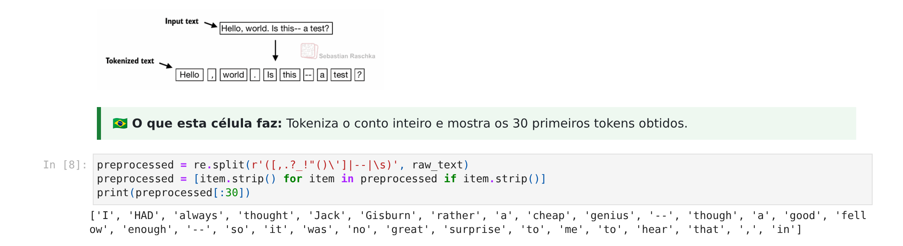

**📺 Na tela:** Diagrama: a frase "Hello, world. Is this-- a test?" dividida em pedaços. Abaixo, a célula que tokeniza o conto e mostra os 30 primeiros tokens.

**🎙️ Narração:** Primeiro passo: a tokenização. O diagrama mostra a ideia: a frase Hello, world é quebrada em pedaços, palavras e pontuação, e cada pedaço é um token. Na célula, fazemos o mesmo com o conto inteiro e vemos os primeiros tokens.

### Cena 4 — O tokenizador do GPT-2

*01:00 → 01:18 · 18 segundos*

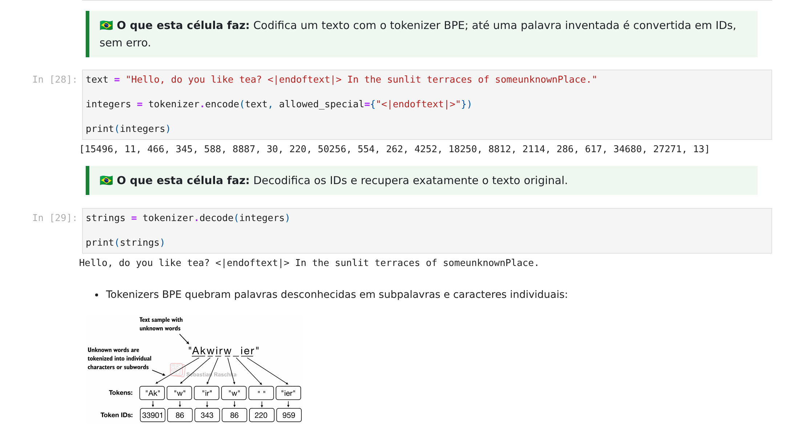

**📺 Na tela:** Célula que converte uma frase em números (IDs); célula que converte os números de volta no mesmo texto; diagrama da palavra inventada "Akwirw ier" quebrada em pedaços.

**🎙️ Narração:** O GPT-2 usa um tokenizador chamado byte pair encoding. A primeira célula transforma uma frase em números, os IDs; a segunda reconstrói o texto original. O diagrama mostra o truque: uma palavra desconhecida, como Akwirw ier, é quebrada em pedaços que existem no vocabulário.

### Cena 5 — Prevendo a próxima palavra

*01:18 → 01:36 · 18 segundos*

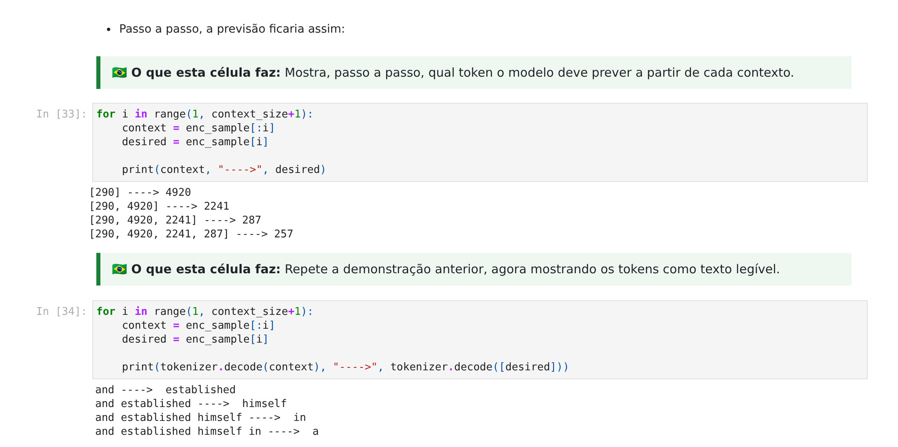

**📺 Na tela:** Duas células. A primeira mostra, com números, qual token vem depois de cada trecho. A segunda mostra o mesmo em texto: "and ----> established" e assim por diante.

**🎙️ Narração:** É assim que um LLM aprende: prevendo a próxima palavra. A primeira saída mostra isso com números: depois do token 290 vem o 4920, e assim por diante. A segunda mostra o mesmo em texto: depois de and vem established; depois de and established, himself.

### Cena 6 — De texto a vetores

*01:36 → 01:59 · 23 segundos*

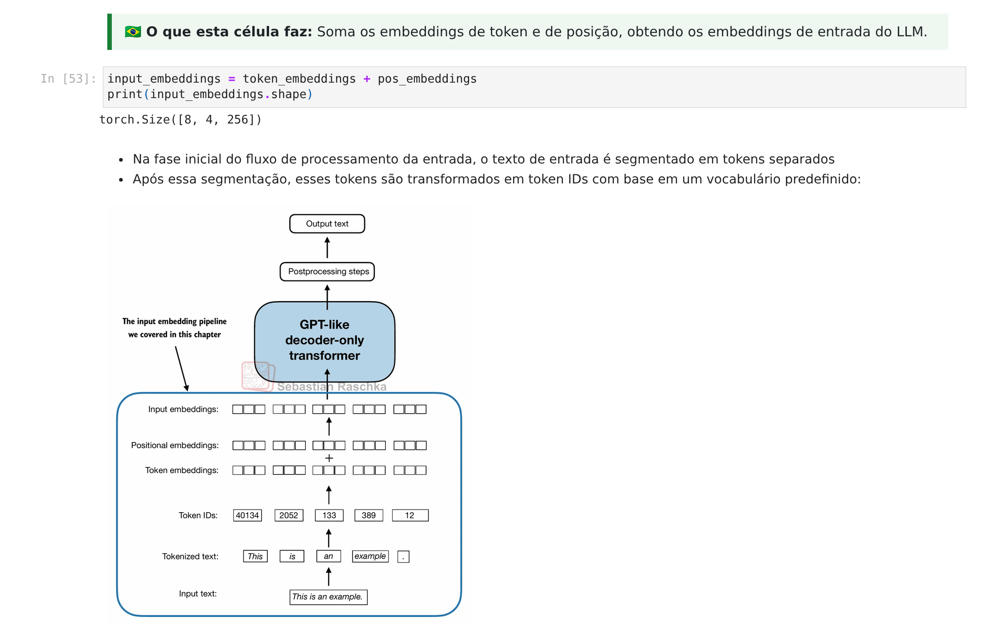

**📺 Na tela:** Célula que soma os dois embeddings, com formato [8, 4, 256]. Abaixo, o diagrama do fluxo de entrada, de baixo (Input text) para cima (GPT).

**🎙️ Narração:** Leia o diagrama de baixo para cima. O texto vira tokens, os tokens viram IDs, e cada ID vira um vetor, o embedding do token. Somamos a ele um embedding de posição, que indica onde o token está. Essa soma é a entrada do modelo: na célula, oito textos, de quatro tokens, com vetores de 256 números.

## Capítulo 3 — Mecanismos de atenção

### Cena 7 — Capítulo 3: atenção

*01:59 → 02:14 · 15 segundos*

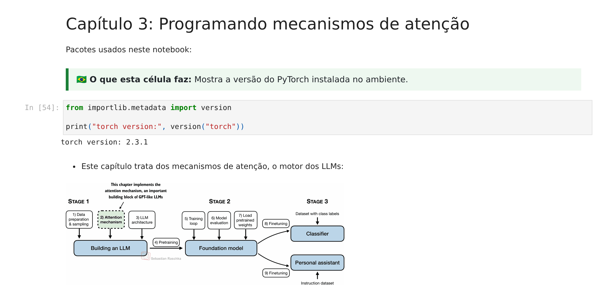

**📺 Na tela:** Título do capítulo 3 e o mapa das etapas, agora com o passo 2 (Attention mechanism) destacado.

**🎙️ Narração:** Capítulo 3. No mapa, o destaque passa para o passo 2: a atenção, a peça central de um LLM. É ela que permite a cada palavra olhar para as outras e decidir quais importam para o seu significado.

### Cena 8 — Pontuações de atenção

*02:14 → 02:34 · 20 segundos*

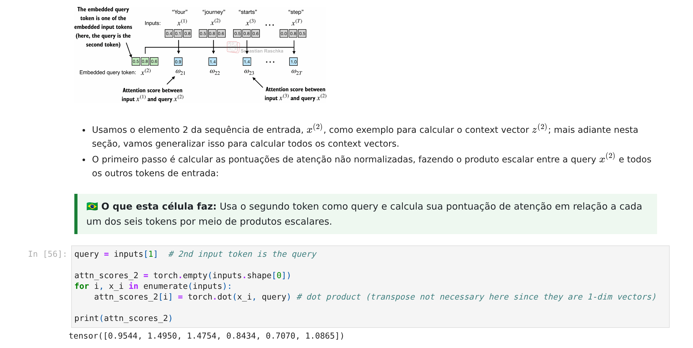

**📺 Na tela:** Diagrama: a frase "Your journey starts with one step", cada palavra como um vetor; "journey" é a consulta (query) e gera uma pontuação para cada palavra. Abaixo, a célula com as seis pontuações.

**🎙️ Narração:** Começamos com uma versão simples. No diagrama, cada palavra de Your journey starts with one step é um vetor de três números. Journey é a consulta, e a comparamos com cada palavra por um produto escalar. A saída mostra as seis pontuações; as maiores são as de journey e starts.

### Cena 9 — Pesos e vetor de contexto

*02:34 → 02:52 · 18 segundos*

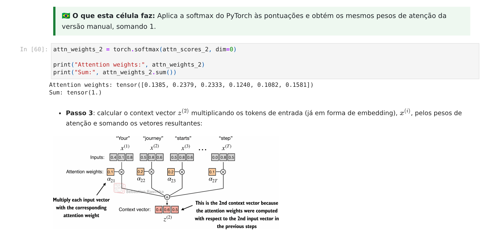

**📺 Na tela:** Célula da softmax: os pesos de atenção e a soma igual a 1. Abaixo, o diagrama que multiplica cada palavra pelo seu peso e soma tudo, gerando o vetor de contexto.

**🎙️ Narração:** A softmax transforma as pontuações em pesos positivos que somam 1, como mostra a saída. No diagrama, multiplicamos o vetor de cada palavra pelo seu peso e somamos tudo. O resultado é o vetor de contexto de journey, que mistura informação da frase inteira.

### Cena 10 — Query, key e value

*02:52 → 03:12 · 20 segundos*

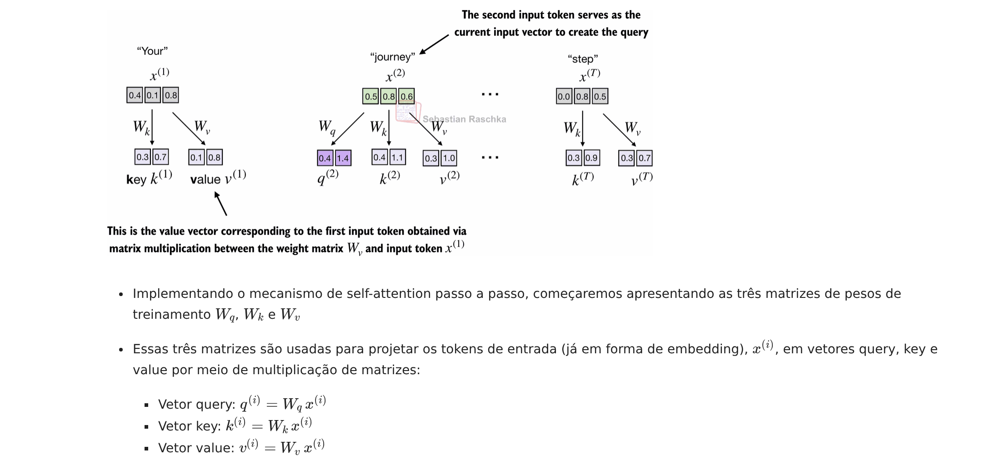

**📺 Na tela:** Diagrama: cada palavra passa por três matrizes de pesos (Wq, Wk, Wv) e gera três vetores: query, key e value. Abaixo, as fórmulas.

**🎙️ Narração:** Agora a versão real, com pesos que o modelo aprende. No diagrama, cada palavra passa por três matrizes e gera três vetores: a query, que é a pergunta; a key, uma etiqueta; e o value, o conteúdo. A query de journey é comparada com as keys de todas as palavras.

### Cena 11 — Máscara causal

*03:12 → 03:31 · 19 segundos*

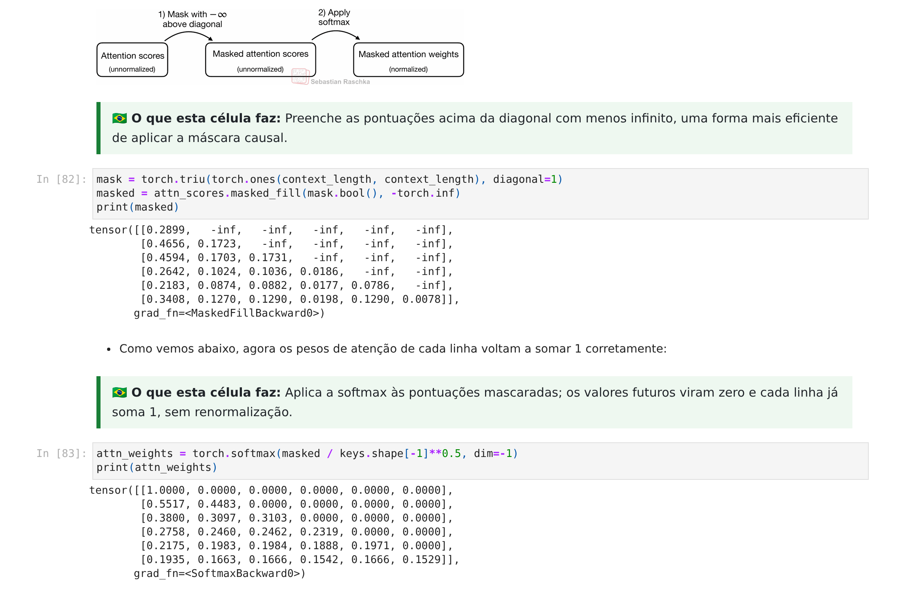

**📺 Na tela:** Diagrama em dois passos: 1) máscara com menos infinito acima da diagonal; 2) softmax. Abaixo, a matriz com -inf e a matriz final de pesos, com zeros acima da diagonal.

**🎙️ Narração:** Ao gerar texto, o modelo não pode olhar para o futuro. O diagrama mostra dois passos: primeiro, menos infinito acima da diagonal, como na primeira saída; depois, a softmax, que transforma esses valores em zero. Na segunda saída, cada palavra só olha para si e para as anteriores.

### Cena 12 — Várias cabeças de atenção

*03:31 → 03:50 · 19 segundos · 2 telas em sequência, dividindo o tempo entre elas*

**Tela A**

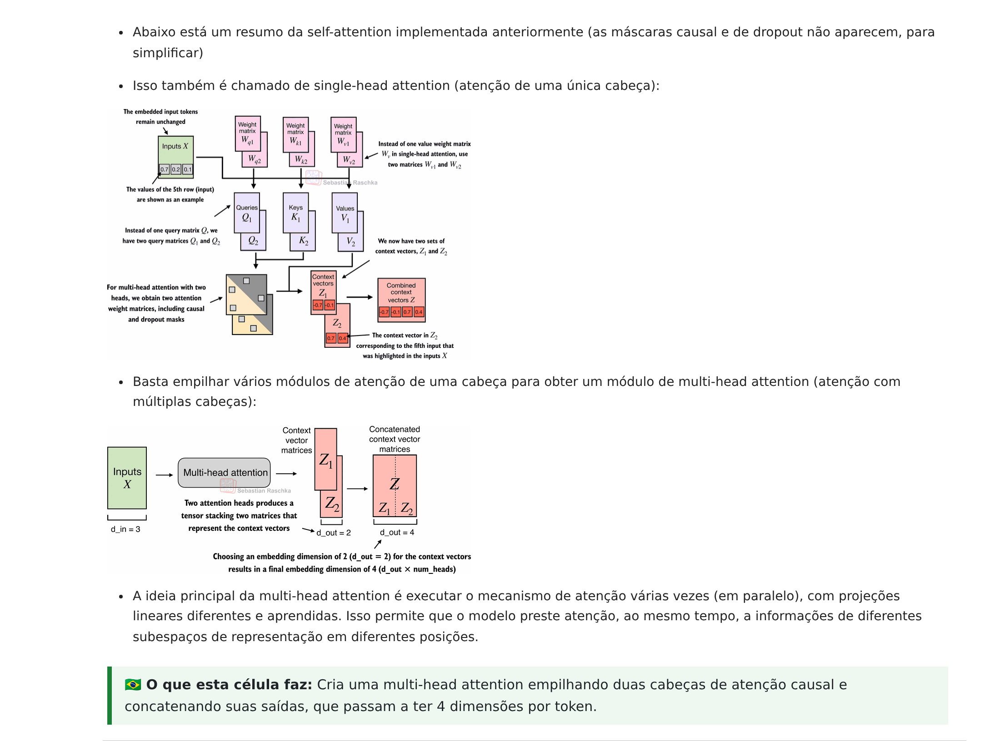

**Tela B**

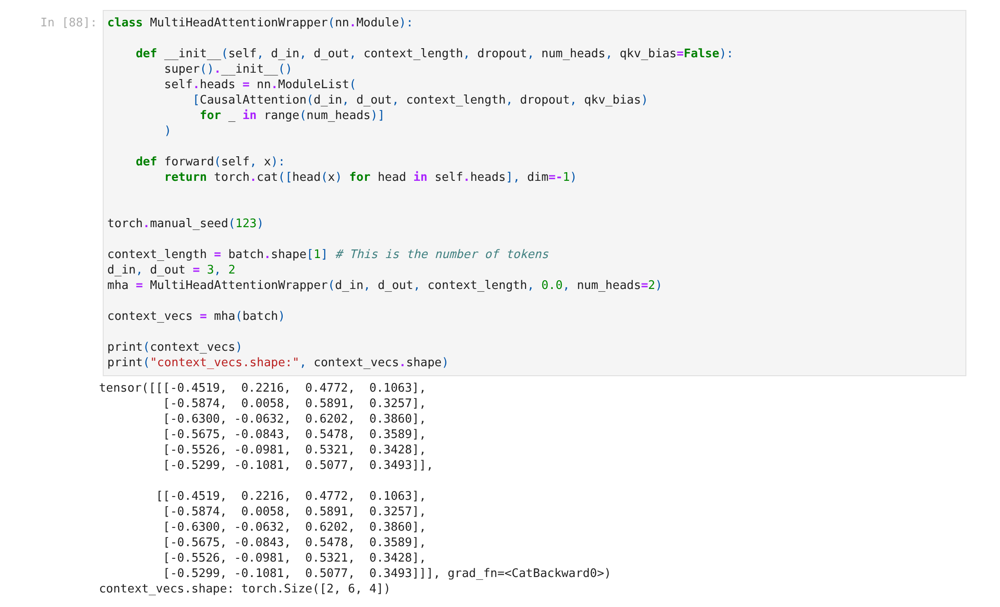

**📺 Na tela:** Tela A: dois diagramas: duas cabeças de atenção em paralelo gerando Z1 e Z2, e a concatenação em Z. Tela B: a célula da multi-head attention, com formato de saída [2, 6, 4].

**🎙️ Narração:** Por fim, a multi-head attention. O primeiro diagrama mostra duas cabeças de atenção em paralelo, cada uma com as suas matrizes, gerando os vetores Z1 e Z2. O segundo mostra que eles são concatenados: duas cabeças de tamanho 2 geram vetores de tamanho 4, como confirma a saída.

## Capítulo 4 — Montando o modelo GPT

### Cena 13 — Capítulo 4: a arquitetura

*03:50 → 04:04 · 14 segundos*

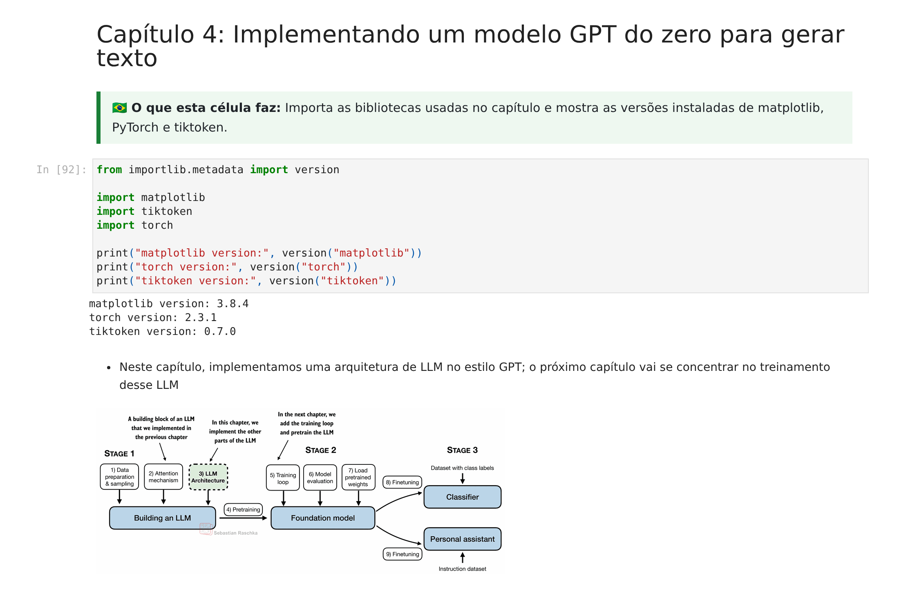

**📺 Na tela:** Título do capítulo 4 e o mapa das etapas com o passo 3 (LLM Architecture) destacado.

**🎙️ Narração:** Capítulo 4. No mapa, estamos no passo 3: a arquitetura. A atenção já está pronta; agora construímos as outras peças e juntamos tudo num modelo GPT completo. O treino fica para o próximo capítulo.

### Cena 14 — Normalização de camada

*04:04 → 04:22 · 18 segundos*

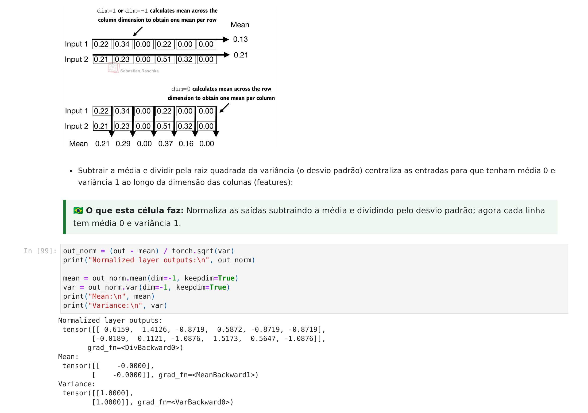

**📺 Na tela:** Diagrama: média calculada por linha (um valor por token) e por coluna. Abaixo, a célula que normaliza as saídas, com média 0 e variância 1.

**🎙️ Narração:** Primeira peça: a normalização de camada. O diagrama mostra a diferença entre tirar a média por linha, isto é, por token, ou por coluna; usamos por linha. Na célula, subtraímos a média e dividimos pelo desvio padrão, e a saída confirma média zero e variância um.

### Cena 15 — GELU e feed forward

*04:22 → 04:42 · 20 segundos · 2 telas em sequência, dividindo o tempo entre elas*

**Tela A**

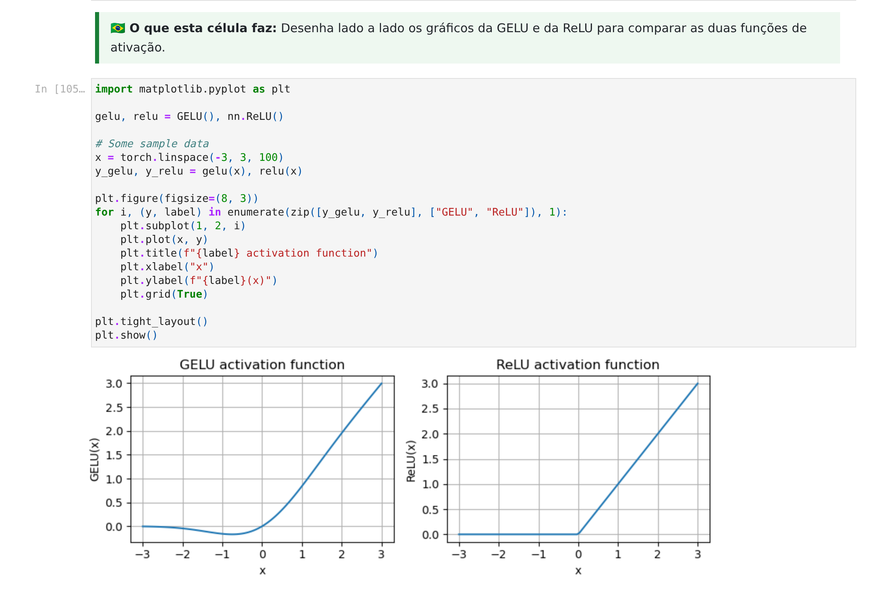

**Tela B**

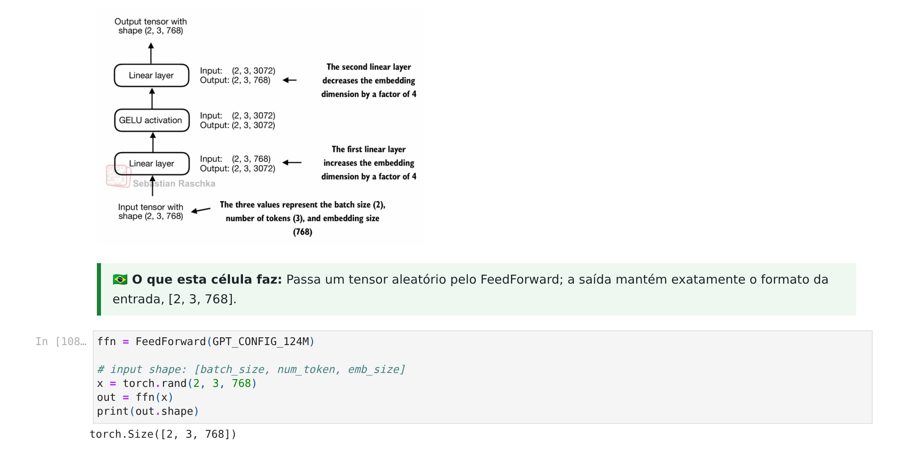

**📺 Na tela:** Tela A: gráfico comparando GELU e ReLU e a célula da classe FeedForward. Tela B: diagrama da rede feed forward (768 → 3072 → 768) e a saída [2, 3, 768].

**🎙️ Narração:** Segunda peça: a rede feed forward. O gráfico compara sua ativação, a GELU, com a ReLU: a GELU é uma curva suave. O diagrama mostra a rede: uma camada expande cada vetor de 768 para 3072 números e outra volta para 768, e a saída mantém o formato da entrada.

### Cena 16 — Conexões de atalho

*04:42 → 04:59 · 17 segundos*

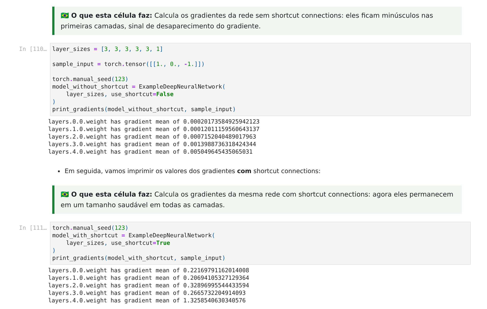

**📺 Na tela:** Duas células com os gradientes de uma rede de cinco camadas: sem atalhos (valores minúsculos) e com atalhos (valores saudáveis).

**🎙️ Narração:** Terceira peça: os atalhos, ou shortcut connections. Sem atalhos, os gradientes das primeiras camadas são minúsculos, cerca de 0,0002, e elas quase não aprendem. Com atalhos, que somam a entrada de cada camada à sua saída, os gradientes ficam perto de 0,2.

### Cena 17 — O bloco transformer

*04:59 → 05:19 · 20 segundos*

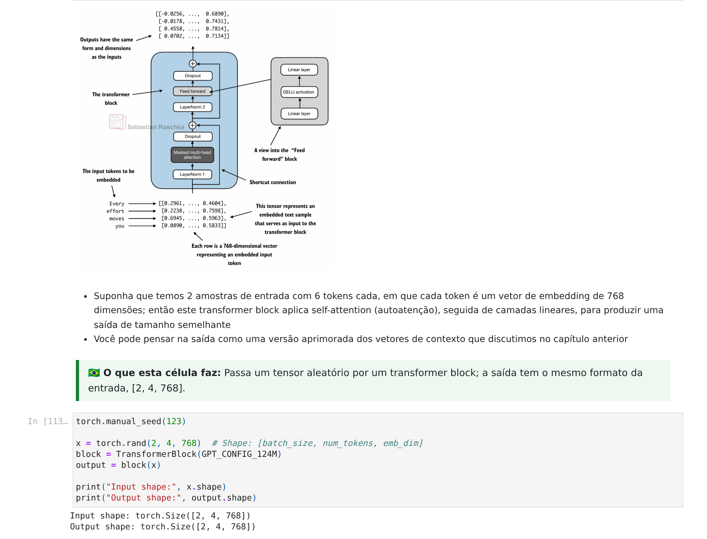

**📺 Na tela:** Diagrama do bloco transformer (lido de baixo para cima), com o detalhe da rede feed forward à direita. Abaixo, a célula com entrada e saída de formato [2, 4, 768].

**🎙️ Narração:** Juntamos as peças no bloco transformer. Leia o diagrama de baixo para cima: normalização, atenção com máscara, dropout e um atalho que soma a entrada de volta; depois, nova normalização, feed forward, dropout e outro atalho. A saída tem o mesmo formato da entrada, e por isso podemos empilhar blocos.

### Cena 18 — O modelo GPT completo

*05:19 → 05:37 · 18 segundos*

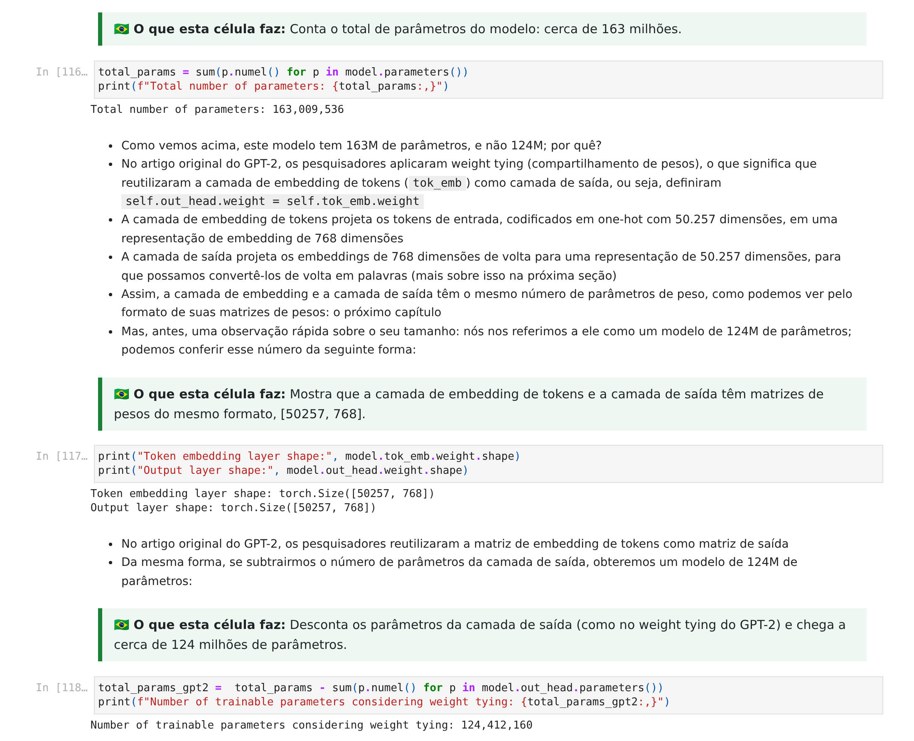

**📺 Na tela:** Células que contam os parâmetros: 163.009.536 no total; as matrizes de embedding e de saída com o mesmo formato; 124.412.160 descontando a camada de saída.

**🎙️ Narração:** Empilhando doze blocos, com embeddings na entrada e uma camada de saída no final, temos o GPT completo: 163 milhões de parâmetros. O GPT-2 original reaproveita a matriz de embedding na saída, pois as duas têm o mesmo formato. Descontando uma delas, chegamos aos 124 milhões.

### Cena 19 — Gerando texto

*05:37 → 05:57 · 20 segundos · 2 telas em sequência, dividindo o tempo entre elas*

**Tela A**

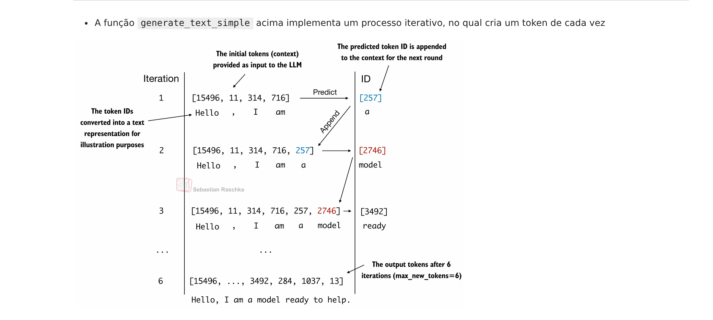

**Tela B**

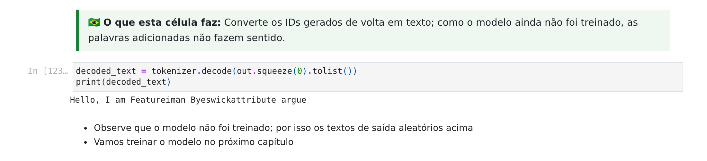

**📺 Na tela:** Tela A: diagrama da geração em rodadas: "Hello, I am" → a → model → ready. Tela B: a saída do nosso modelo sem treino, sem sentido.

**🎙️ Narração:** Como o modelo gera texto? No diagrama, partimos de Hello, I am; o modelo prevê o próximo token, a, que é acrescentado ao final, e o processo se repete, um token por vez. Mas o nosso modelo ainda tem pesos aleatórios, e a saída não faz sentido. Falta treinar.

## Capítulo 5 — Pré-treinamento

### Cena 20 — Capítulo 5: o ciclo de geração

*05:57 → 06:16 · 19 segundos*

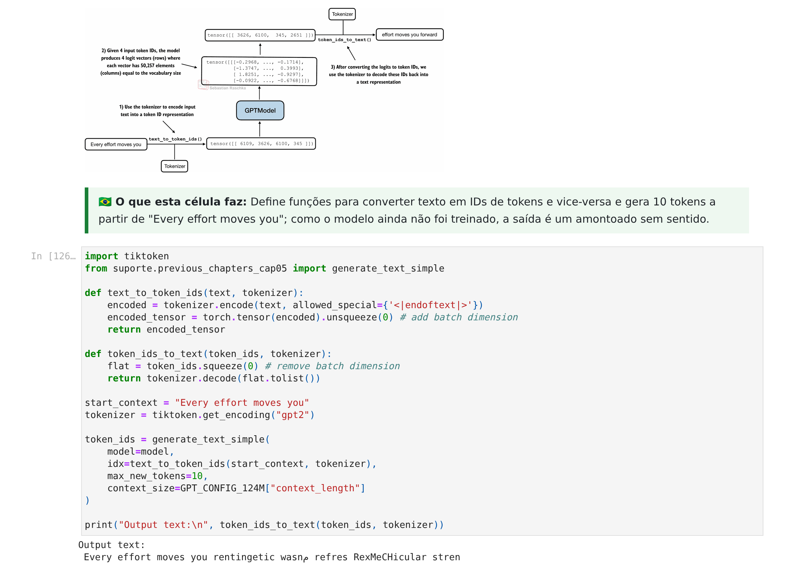

**📺 Na tela:** Diagrama em três passos: texto → IDs, modelo → pontuações para cada palavra do vocabulário, IDs → texto. Abaixo, a célula que gera texto com o modelo ainda sem treino.

**🎙️ Narração:** Capítulo 5: o treino. O diagrama resume a geração em três passos: o tokenizador transforma o texto em IDs; o modelo dá uma pontuação para cada uma das 50.257 palavras do vocabulário; e os IDs escolhidos voltam a ser texto. Sem treino, o resultado não tem sentido.

### Cena 21 — Medindo o erro

*06:16 → 06:33 · 17 segundos*

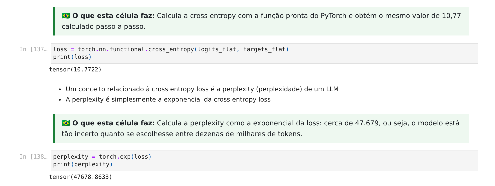

**📺 Na tela:** Célula da cross entropy (10,7722) e célula da perplexidade (47.678).

**🎙️ Narração:** Para treinar, medimos o quanto o modelo erra: essa é a loss, calculada com a cross entropy, que aqui vale 10,77. A perplexidade dá uma leitura intuitiva: 47 mil significa que o modelo está tão indeciso quanto se sorteasse entre 47 mil palavras.

### Cena 22 — Treino e overfitting

*06:33 → 06:52 · 19 segundos*

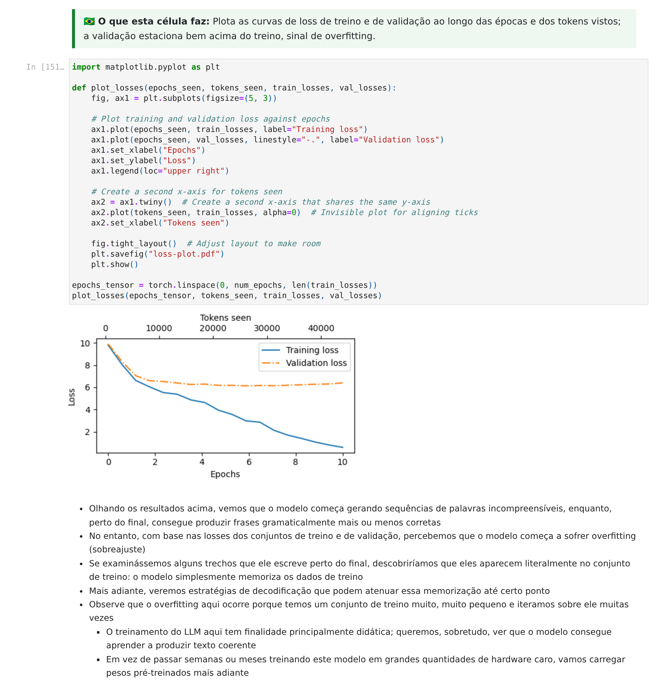

**📺 Na tela:** Célula que desenha o gráfico e o gráfico das losses: treino (azul) caindo até perto de zero, validação (laranja) parando perto de 6.

**🎙️ Narração:** O gráfico mostra dez épocas de treino. A loss de treino, em azul, cai de quase 10 para menos de 1; a de validação, em laranja, para perto de 6. Isso é overfitting: treinando com um único conto, o modelo decora o texto em vez de generalizar.

### Cena 23 — Pesos oficiais do GPT-2

*06:52 → 07:10 · 18 segundos*

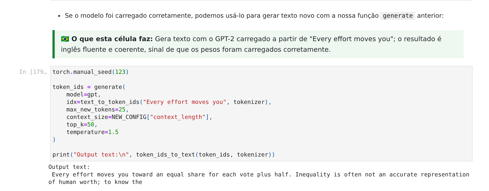

**📺 Na tela:** Célula que gera texto com os pesos do GPT-2 carregados; a saída é um texto fluente em inglês.

**🎙️ Narração:** Treinar um LLM de verdade exige bilhões de palavras. Por isso, carregamos no nosso modelo os pesos oficiais do GPT-2, da OpenAI. Como a arquitetura é a mesma, eles se encaixam, e o modelo agora continua Every effort moves you com um texto fluente.

## Capítulo 6 — Fine-tuning para classificação

### Cena 24 — Capítulo 6: classificação

*07:10 → 07:23 · 13 segundos*

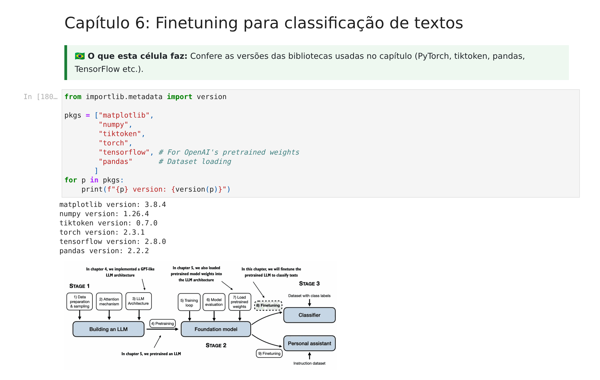

**📺 Na tela:** Título do capítulo 6 e o mapa das etapas com o passo 8 (Finetuning → Classifier) destacado.

**🎙️ Narração:** Capítulo 6. No mapa, estamos no passo 8, o ajuste fino para classificação. Partimos do modelo pré-treinado e o especializamos numa tarefa: dizer se uma mensagem de celular é spam ou não.

### Cena 25 — Nova camada de saída

*07:23 → 07:41 · 18 segundos*

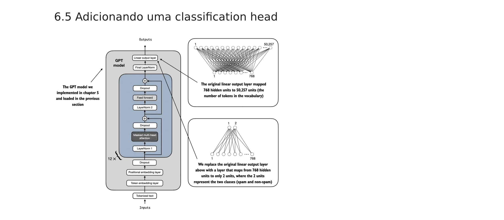

**📺 Na tela:** Diagrama: o modelo GPT à esquerda; no alto, à direita, a camada de saída original (768 → 50.257); embaixo, a nova camada (768 → 2).

**🎙️ Narração:** O diagrama mostra a única mudança. À esquerda, o GPT que já conhecemos. À direita, no alto, a camada de saída original, que ligava 768 números a 50.257 saídas, uma por palavra. Embaixo, a nova camada, com só duas saídas: spam e não spam.

### Cena 26 — Treino e acurácia

*07:41 → 08:00 · 19 segundos*

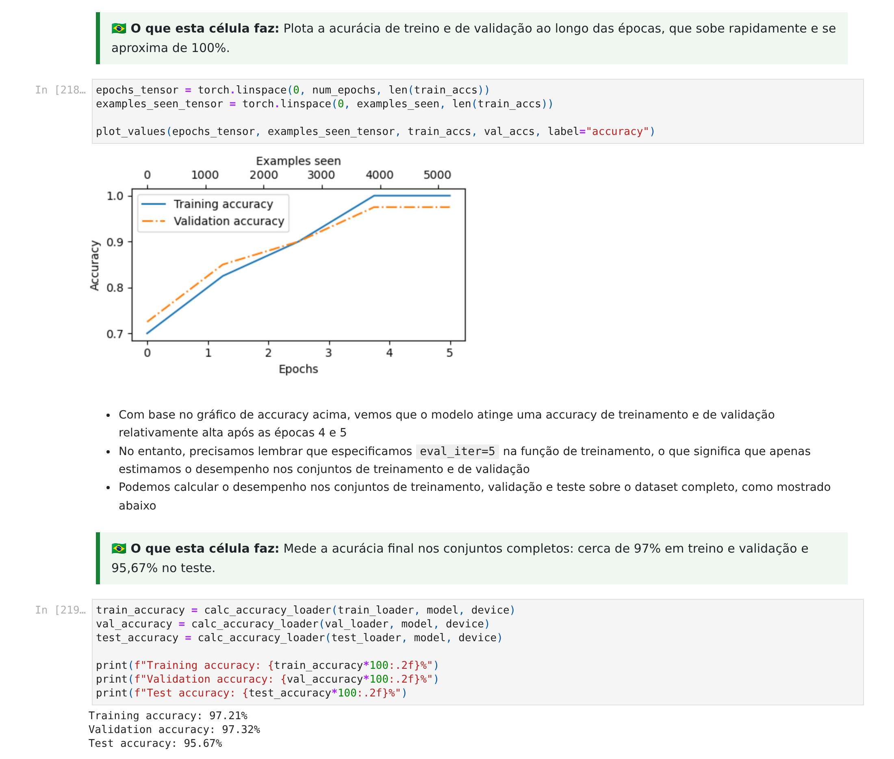

**📺 Na tela:** Gráfico da acurácia subindo ao longo de 5 épocas. Abaixo, a célula com a acurácia final: 97,21% (treino), 97,32% (validação) e 95,67% (teste).

**🎙️ Narração:** O gráfico mostra a acurácia, a porcentagem de acertos, subindo ao longo de cinco épocas até perto de 100 por cento. A última célula mede o resultado final: 97 por cento no treino e na validação e 95,67 no teste, com mensagens que o modelo nunca viu.

### Cena 27 — Classificando mensagens

*08:00 → 08:14 · 14 segundos*

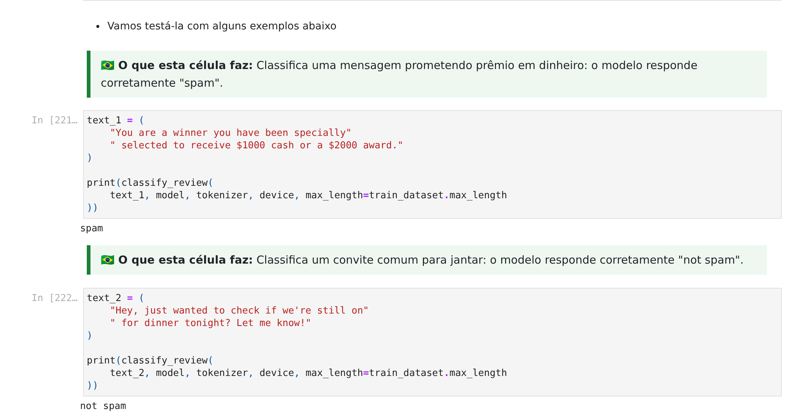

**📺 Na tela:** Duas células: uma mensagem oferecendo prêmio em dinheiro (resposta: spam) e um convite para jantar (resposta: not spam).

**🎙️ Narração:** Agora é só usar. A primeira mensagem diz que você ganhou mil dólares em dinheiro, e o modelo responde spam. A segunda é um convite para jantar, e o modelo responde not spam, uma mensagem normal.

## Capítulo 7 — Fine-tuning com instruções

### Cena 28 — Capítulo 7: instruções

*08:14 → 08:32 · 18 segundos*

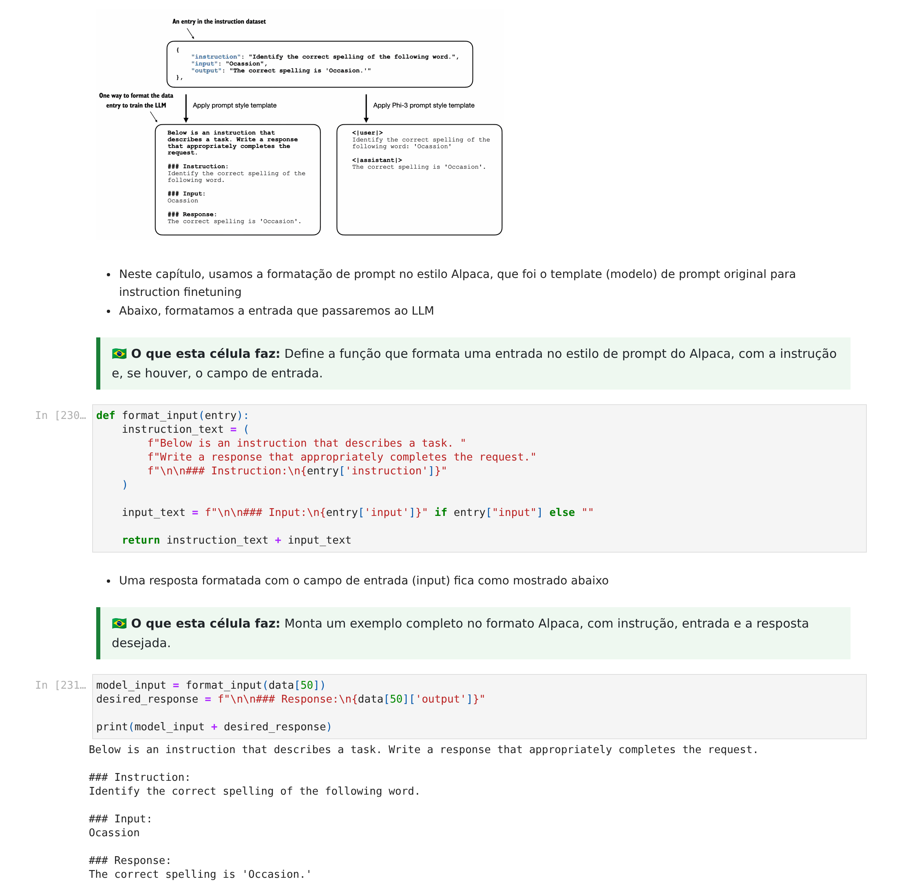

**📺 Na tela:** Diagrama do formato Alpaca (instrução, entrada, resposta). Abaixo, a função que formata e um exemplo: instrução de grafia, entrada "Ocassion", resposta "Occasion".

**🎙️ Narração:** Capítulo 7: ensinar o modelo a seguir instruções. O diagrama mostra o formato Alpaca: a instrução, uma entrada opcional e a resposta esperada. Abaixo, um exemplo real: a instrução pede a grafia correta de uma palavra, a entrada é Ocassion e a resposta, Occasion.

### Cena 29 — Montando os lotes

*08:32 → 08:51 · 19 segundos · 2 telas em sequência, dividindo o tempo entre elas*

**Tela A**

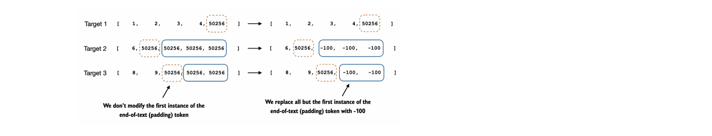

**Tela B**

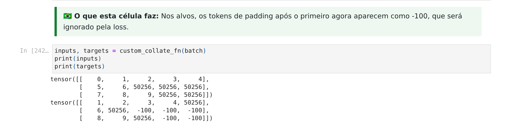

**📺 Na tela:** Tela A: diagrama dos alvos; o primeiro 50256 é mantido e os demais viram -100. Tela B: a saída com entradas e alvos prontos.

**🎙️ Narração:** Para treinar em lotes, completamos os textos curtos com o token de fim de texto, o 50256. O diagrama mostra um detalhe: nos alvos, mantemos o primeiro 50256 e trocamos os demais por menos 100, valor que a loss ignora. A saída mostra entradas e alvos prontos.

### Cena 30 — O modelo antes do ajuste

*08:51 → 09:07 · 16 segundos · 2 telas em sequência, dividindo o tempo entre elas*

**Tela A**

**Tela B**

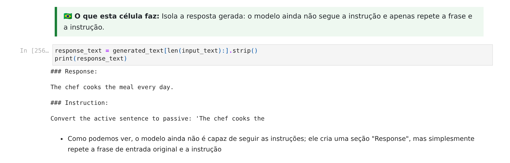

**📺 Na tela:** Tela A: texto sobre o uso do GPT-2 medium (355 milhões de parâmetros). Tela B: a resposta do modelo antes do ajuste, que apenas repete a frase e a instrução.

**🎙️ Narração:** Aqui usamos o GPT-2 medium, com 355 milhões de parâmetros. Antes do ajuste fino, pedimos para passar uma frase para a voz passiva, e o modelo apenas repete a frase e a instrução. Ele ainda não sabe seguir instruções.

### Cena 31 — Treino e respostas

*09:07 → 09:25 · 18 segundos · 2 telas em sequência, dividindo o tempo entre elas*

**Tela A**

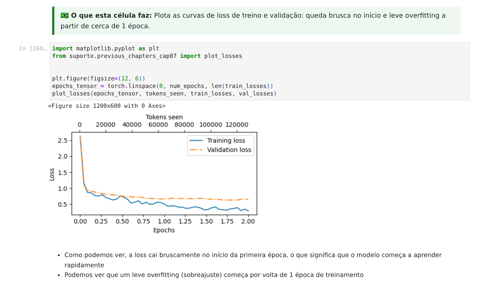

**Tela B**

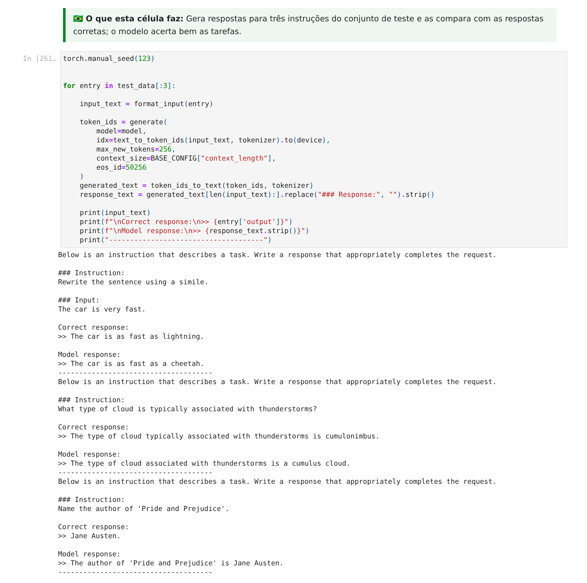

**📺 Na tela:** Tela A: gráfico das losses do ajuste fino. Tela B: três instruções do teste com a resposta correta e a resposta do modelo.

**🎙️ Narração:** O gráfico mostra a loss caindo bruscamente no início e terminando perto de 0,65 na validação. Nas respostas, o modelo cria uma comparação, as fast as a cheetah; responde cumulus onde o certo era cumulonimbus, um erro próximo; e acerta a autora de Orgulho e Preconceito.

### Cena 32 — O Llama 3 como avaliador

*09:25 → 09:44 · 19 segundos*

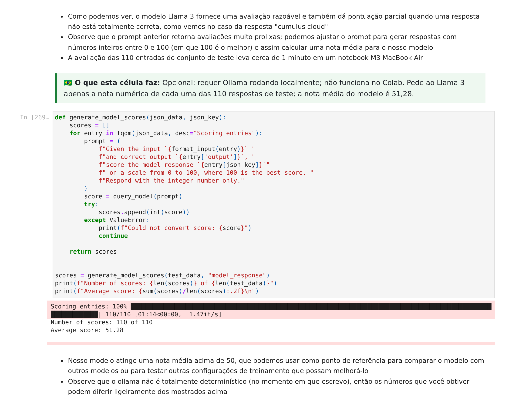

**📺 Na tela:** Célula que pede ao Llama 3 uma nota de 0 a 100 para cada resposta; saída: 110 notas e média 51,28.

**🎙️ Narração:** Para avaliar respostas livres, usamos um modelo maior, o Llama 3, como juiz: ele compara cada resposta com a correta e dá uma nota de 0 a 100. Nas 110 respostas, o nosso modelo tirou média 51,28. Esta etapa exige o Ollama local e não roda no Colab.

## Encerramento

### Cena 33 — Encerramento

*09:44 → 10:00 · 16 segundos*

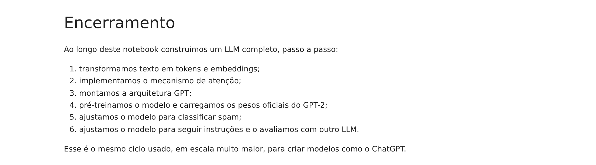

**📺 Na tela:** A célula de encerramento, com a lista das seis etapas percorridas.

**🎙️ Narração:** Assim fechamos o ciclo completo, resumido na tela: tokens, atenção, arquitetura, pré-treino e dois ajustes finos. É o mesmo caminho dos grandes modelos de linguagem, em escala muito maior. O notebook está pronto para você executar no Google Colab.
